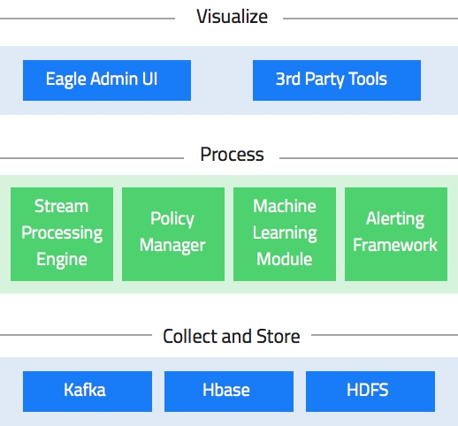
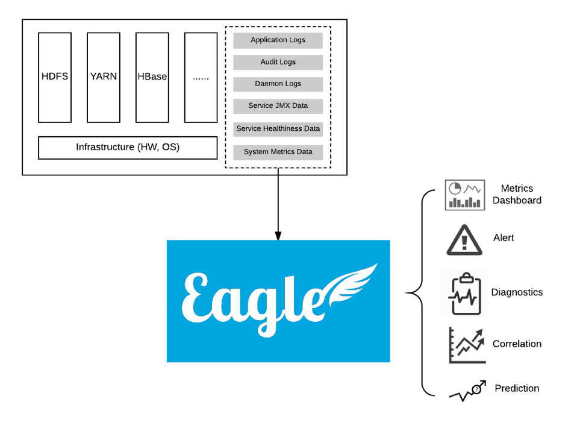

# Apache Eagle
Apache Eagle是一个识别大数据平台上的安全和性能问题的开源解决方案。它主要用来即时监测敏感数据访问和恶意活动，并及时采取行动。除了数据活动管理，Eagle也可以用于节点异常检测,集群和作业性能分析。

## 功能介绍
主要的应用场景包括：监控Hadoop中的数据访问流量;检测非法入侵和违反安全规则的行为;检测并防止敏感数据丢失和访问;实现基于策略的实时检测和预警;实现基于用户行为模式的异常数据行为检测。

- **检测和报警**：Apache Eagle依赖于Apache Storm来进行数据活动和操作日志的流处理，并且可以执行基于策略的检测和报警。它提供多个API：作为基于Storm API上的一层抽象的流式处理API和policy engine provider API的抽象，它将WSO2的开源Siddhi CEP engine作为第一类对象。Siddhi CEP engine支持报警规则的热部署，并且警报可以使用属性过滤和基于窗口的规则（例如，在10分钟内三次以上的访问）来定义。
- 集群和作业性能分析：通过处理YARN应用日志和对YARN中所有运行的作业进行快照分析来完成的。Eagle可以检测单个作业趋势、数据偏斜问题、故障原因和考虑所有运行的作业情况下评估集群的整体性能。
- 基于机器学习的policy provider：Apache Eagle中还包括一个基于机器学习的policy provider。它从过去的用户行为中学习，来将数据访问分类为异常或者正常。这个机器学习policy provider评估在Apache Spark框架中离线训练的模型。

Eagle具有如下特点：

- 高实时： 尽可能地确保能在亚秒级别时间内产生告警，一旦综合多种因素确订为危险操作，立即采取措施阻止非法行为。
- 可伸缩
- 简单易用
- 用户Profile：Eagle 内置提供基于机器学习算法对Hadoop中用户行为习惯建立用户Profile的功能。我们提供多种默认的机器学习算法供你选择用于针对不同HDFS特征集进行建模，通过历史行为模型，Eagle可以实时地检测异常用户行为并产生预警。

## 基本概念
- Site：A site can be considered as a physical data center. Big data platform e.g. Hadoop may be deployed to multiple data centers in an enterprise.
- Application：An "Application" or "App" is composed of data integration, policies and insights for one data source.
- Policy：A "Policy" defines the rule to alert. Policy can be simply a filter expression or a complex window based aggregation rules etc.
- Alerts：An "Alert" is an real-time event detected with certain alert policy or correlation logic, with different severity levels like INFO/WARNING/DANGER.
- Data Source：A "Data Source" is a monitoring target data. Eagle supports many data sources HDFS audit logs, Hive2 query, MapReduce job etc.
- Stream：A "Stream" is the streaming data from a data source. Each data source has its own stream.

## 架构



从这个架构图，可以看到eagle会提供一些内置的应用，通过配置不同的policy，它们能够做很多eagle里面非常核心的事情。

比如一个大的集群里，我们可能希望能够探测一些恶意的操作以及误操作，类似于Hive、MR、Spark的Job，如果一个不相关的人，操作了其他应用独享的数据，这种情况应该及时的通知应用的负责人。security问题在多租户下面其实非常重要，像我们现在一个hadoop集群，不仅仅会提供一些离线的任务，其实这部分任务反而占比很少，大部分都是在线的Yarn任务以及HDFS服务，不同的应用会使用hadoop进行任务分发、状态存储、checkpoint等，但这些任务在文件系统上的隔离是不保证的。在生产环境里，如果某个在线任务的状态文件被其他应用误修改了，整个snapshot都会不可用，一般这样的情况会使当前批次整个回滚，甚至在极端情况下出现错误数据，影响应用的执行语义。

在alertEngine中，你可以添加一个policy，检查JobHistory或者logStash，如果一个Job触发了policy就会通知相关的责任人采取措施。**对大集群的监控和报警实际是非常麻烦和耗时的，eagle很好的解决了这个问题。**

policy的设置非常灵活，甚至可以用机器学习的方式，离线去train一个模型，然后再把这个模型实时的更新上去。具体的做法是在storm这一层去做模型匹配，比如一个用户通常的几个特征量，read、delete、changename等，会去在线查看实际值与正常值的偏差，超过一定程度就会被eagle认为是异常的。或者一个未授权的用户，做了一件从来没有做过的事情，也可以认为是异常的。

通过内置的应用我们还可以进行作业的异常分析：一个Job有多个stage，上一级stage处理完之后，通过group的方式向下一级节点发送数据，假设hash的对象是userid，那么很可能出现的情况是，下一级一共有十个节点，但是partition之后的数据95%都被分配到了同一个节点上。这个问题通常是很难解决的，但有了eagle，我们就可以及时的发现这种情况，并优化提高Job的性能。

异常分析的另一个好处就是节点分析。稍微大一点规模的Job可能就需要几十上百个节点来执行，通常过程中如果挂掉一个节点，触发FailOver机制重新调度是可以解决的。但如果某个节点上的job经常失败，那么这个节点就应该被识别出来进行处理，避免大量job的重新调度开销。

## 内置应用
上面这些功能需要底层架构给予支持。eagle底层的流计算引擎是基于storm的，我们知道在传统领域，比如OLAP、数据库这些，通常都会有一门DSL来方便大家使用。近来在流计算领域，一个比较火爆的概念就是我们能不能也创造一门DSL，类似于SQL，但数据却是流式的。比如Spark的StructureStreaming，Flink的TableApi都是因为这个而产生。在eagle上为了支持更方便的执行policy和动态更新，也是需要一个DSL。那么它的做法比较讨巧，相当于利用了Siddhi这个现成的CEP，集成到storm的框架里，利用Siddhi本身的SQL支持来实现storm的DSL。那么用户无论是自定义policy还是自己编写应用，都可以像下面这样写：

- 定义流定义和查询，并将结果输出到另外一个流里面。

``` sql
define stream TempStream (deviceID long, roomNo int, temp double);
from TempStream 
select roomNo, temp * 9/5 + 32 as temp, F as scale, roomNo >= 100 and roomNo < 110 as isServerRoom
insert into RoomTempStream;
```

- 多流Join和TimeWindow。

``` sql
from TempStream[temp > 30.0]#window.time(1 min) as T 
join RegulatorStream[isOn == false]#window.length(1) as R
on T.roomNo == R.roomNo
select T.roomNo, T.temp, R.deviceID, start as action
insert into RegulatorActionStream ;
```

- Pattern Query：这个比较能体现CEP的优势，在下面的查询中，->标示的是事件顺序，也就是说，这个语义实际上表达了同一张卡在一天内，出现一次取现金额 < 100后再次出现取现金额 > 10000的情况，并将其判断为fraud。这是传统SQL所不具备的，也可以说是专为流式计算而设计。

``` sql
from every a1 = atmStatsStream[amountWithdrawed < 100]
-> b1 = atmStatsStream[amountWithdrawed > 10000 and a1.cardNo == b1.cardNo]
within 1 day
select a1.cardNo as cardNo, a1.cardHolderName as cardHolderName, b1.amountWithdrawed as amountWithdrawed, b1.location as location, b1.cardHolderMobile as cardHolderMobile
insert into possibleFraudStream;
```

## 元数据设计
在集群中可能有成百上千个节点，每个节点上GB甚至上TB的的日志文件，如果出现一个异常的访问点，我们希望能在毫秒级别上对其进行预警或者是拦截。然后我们知道storm有一个很大的缺陷是它本身逻辑定义完就固定了。按照以往，这种分布式stream逻辑定义完，想再修改系统，必须要把topology重启，生产环境下肯定不希望这样，牺牲实时性的代价太大了，所以eagle整个的结构是元数据驱动（Metadata Driven）。



从上图我们可以看出eagle的输入和输出其实是非常明确的，那么在元数据的定义上，因为下面的存储是基于Hbase，所以eagle做的非常的灵活。一般对于同一个类型的采集日志(例如某个metric)，在RowKey上会采用一个固定的前缀，后面加上时间序列，这样在设计上就保证了分布性和同一个metric在数据上的连续性。

在生产场景下，可能一开始训练的Policy模型只有几个G的样本数据，但这个数据的增长是非常快的。那么我们不可能在一个月之后，还不去更换它。在eagle中这样的更新是很简单的。由于eagle的元数据驱动特性，engine会去监听元数据的变化。一旦metadata触发了alertEngine注册的listener，内部是可以通过ClassLoader动态部署的，比如动态的去更新storm里面的spout和bolt，这样整个更新过程可以在毫秒的级别就做完，相对来说，提高了几个数量级，并且这个过程是不会丢失数据的。

## 编写自定义应用
下面简单介绍一下如何编写一个自己的扩展应用：

- 首先需要提供应用的Provider

```java
public class ExampleApplicationProvider extends AbstractApplicationProvider {
private static final Logger LOG = LoggerFactory.getLogger(ExampleApplicationProvider.class);

@Override
public ExampleStormApplication getApplication() {
    return new ExampleStormApplication();
}

@Override
public Optional getApplicationListener() {
    return Optional.of(new ApplicationListener() {

        @Inject ExampleEntityService entityService;
        private ApplicationEntity application;

        @Override
        public void init(ApplicationEntity applicationEntity) {
            this.application = applicationEntity;
            entityService.getEntities();
        }

        @Override
        public void afterInstall() {
            LOG.info("afterInstall {}", this.application);
        }

        @Override
        public void afterUninstall() {
            LOG.info("afterUninstall {}", this.application);
        }

        @Override
        public void beforeStart() {
            LOG.info("beforeStart {}", this.application);
        }

        @Override
        public void afterStop() {
            LOG.info("afterStop {}", this.application);
        }
    });
}

@Override
protected void onRegister() {
    bindToMemoryMetaStore(ExampleEntityService.class,ExampleEntityServiceMemoryImpl.class);
    bind(ExampleCommonService.class,ExampleCommonServiceImpl.class);
}
```

这里需要注意的是，应用本身的Meta是需要指定存储方式的，这个例子里面我们简单指定为Memory的方式。当然，在生产环境一般可以换成Hbase。

- 然后提供应用本身的逻辑

```java
public class ExampleStormApplication extends StormApplication {
@Override
public StormTopology execute(Config config, StormEnvironment environment) {
    TopologyBuilder builder = new TopologyBuilder();
    builder.setSpout("metric_spout", environment.getStreamSource("SAMPLE_STREAM", config)
        , config.getInt("spoutNum"));
    builder.setBolt("sink_1", environment.getStreamSink("SAMPLE_STREAM_1", config)).fieldsGrouping("metric_spout",
        new Fields("metric"));
    builder.setBolt("sink_2", environment.getStreamSink("SAMPLE_STREAM_2", config)).fieldsGrouping("metric_spout",
        new Fields("metric"));
    return builder.createTopology();
}
```

- 最后通过配置指定执行环境等参数

```json
"application": {
    "sink": {
      "type": "org.apache.eagle.app.messaging.KafkaStreamSink",
      "config": {
        "kafkaBrokerHost": "",
        "kafkaZkConnection": ""
      }
    },
    "storm": {
      "nimbusHost": "localhost"
      "nimbusThriftPort": 6627
    }
},

"appId": "unit_test_example_app"
"spoutNum": 3
"loaded": true
"mode": "LOCAL"
"dataSinkConfig": {
"topic": "test_topic",
"brokerList": "sandbox.hortonworks.com:6667",
"serializerClass": "kafka.serializer.StringEncoder",
"keySerializerClass": "kafka.serializer.StringEncoder"
}
```

这里要配置好source和sink，比如kafka的topic、broker。限于篇幅，这里略去了coordinator自身的配置。完成上面的代码和配置，也就完成了一个自定义的应用编写。


## 数据集成
数据集成使用Apache Kafka通过logstash forwarder 代理或通过log4j kafka appender来实现的。来自多个Hadoop守护进程（例如，namenode，datanode等）的日志条目被反馈到Kafka并由Storm处理。Eagle支持将数据资产分类为多个灵敏度类型。

## 数据持久化
Eagle支持使用Apache HBase和关系数据库持久化警报。警报可通过电子邮件、Kafka或存储在Eagle支持的存储中进行通知。你也可以开发自己的警报通知插件。

## 结语
从前面的介绍我们可以看出，整个eagle其实是一套整体的解决方案，这个方案更多的是在应用的层面上进行了许多创新性的使用和整合。但eagle的实时性、可扩展性不仅仅值得在hadoop集群中使用，里面的很多思想其实也是值得给想要搭建流式计算平台的同学进行参考和学习的。而对于底层框架的开发同学，其实eagle在算子层、API层、状态存储层做的许多事情正是很多应用开发者需要自己去做的事情，能不能给开发应用更多的支持，让开发更顺畅更快速，也是值得去思考一下的。

## 参考
- [Apache Eagle毕业成为顶级项目](http://www.infoq.com/cn/news/2017/02/apache-eagle-graduates-top-level)
- [Apache Eagle 陈浩——Apache+Eagle：架构演化和新特性](https://doc.huodongjia.com/detail-944.html)
- [Apache Eagle 简介--分布式实时 Hadoop 数据安全方案](https://www.cnblogs.com/junneyang/p/5882157.html)
- [Apache Eagle——eBay开源分布式实时Hadoop数据安全方案](http://www.csdn.net/article/2015-10-29/2826076?ref=myread)
- [Getting Started Eagle](http://eagle.apache.org/docs/latest/getting-started/)
- [ kafka eagle安装与使用](http://blog.csdn.net/whg18526080015/article/details/73642241)
- [Kafka Eagle Reference Manual](https://ke.smartloli.org/)
- []()
- []()


