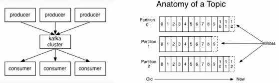
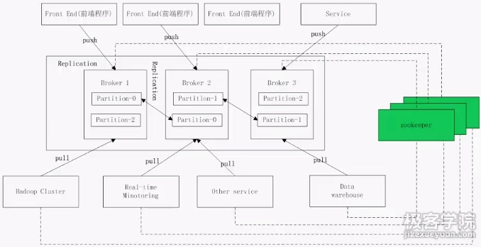

# kafka
是一个分布式消息系统，主要用作数据管道和消息系统。

## kafka的架构
如下图，由生产者向kafka集群生产消息，消费者从kafka集群订阅消息。

其中，kafka集群中的消息是按照主题（或者说Topic）来进行组成的。

- 主题（Topic）：一个主题类似新闻中的体育、娱乐、教育等分类概念，在实际工程中通常一个业务一个主题。
- 分区（Partition）：一个Topic中的消息数据按照多个分区组织，分区是kafka消息队列组织的最小单位，一个分区可以看做是一个FIFO（先进先出）队列；kafka分区是提高kafka性能的关键手段。

这张图在整体上对kafka集群进行了概要，途中kafka集群是由三台机器（Broker）组成，当然，实际情况可能更多。相应的有3个分区，Partition-0~Partition-2，图中能看到每个分区的数据备份了2份。kafka集群从前端应用程序（producer）生产消息，后端通过各种异构的消费者来订阅消息。kafka集群和各种异构的生产者、消费者都使用zookeeper集群来进行分布式协调管理和分布式状态管理、分布式锁服务的。

# 参考
- [Kafka入门学习（一）](http://www.cnblogs.com/quchunhui/p/5356511.html)
- [Kafka topic常见命令解析](https://www.cnblogs.com/huxi2b/p/4571309.html)

