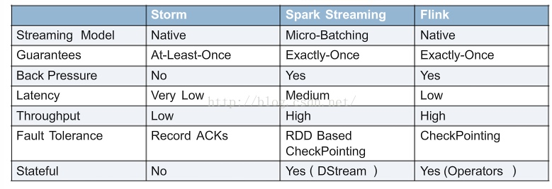
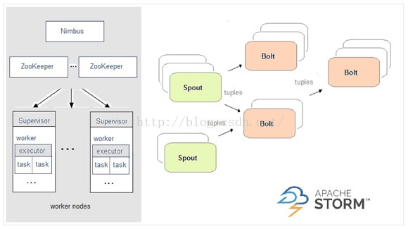
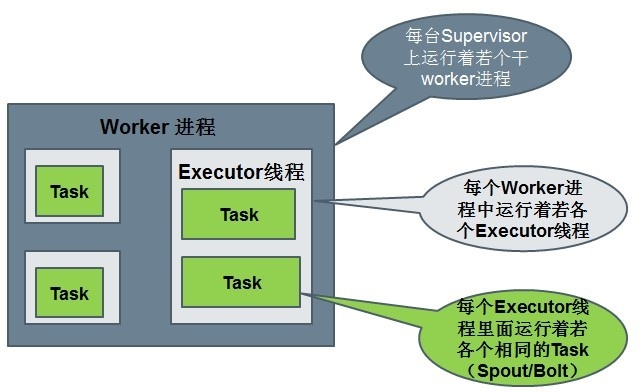
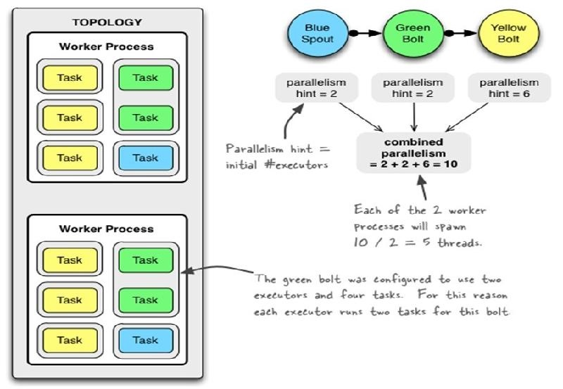
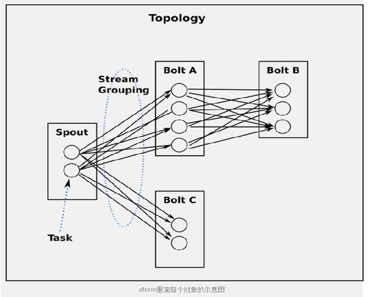
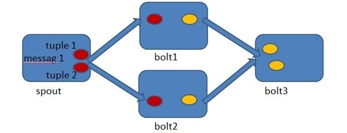
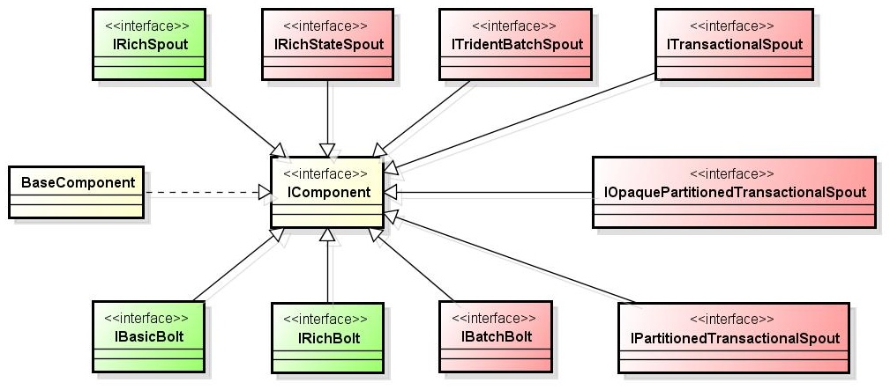
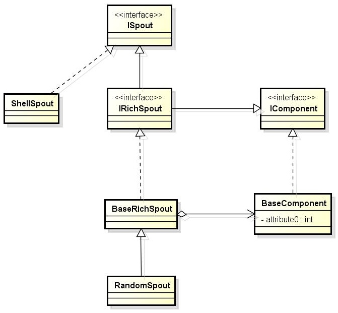
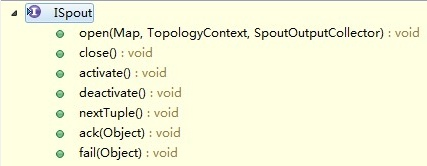
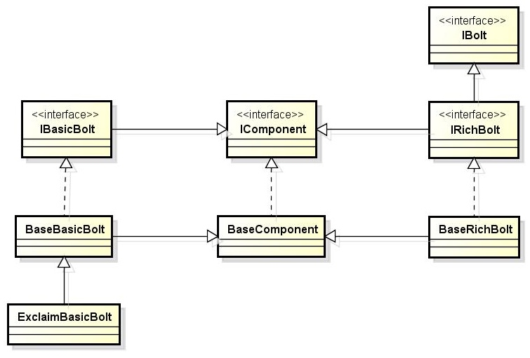

# storm学习
# 原理和实例部分
## 流式框架对比
Hadoop只能处理适合进行批量计算的需求；Storm用来解决分布式流式计算系统。除此之外，流计算还有spark streaming和flink。对比：



- 如果你想要的是一个允许增量计算的高速事件处理系统，Storm会是最佳选择。
- 如果你必须有状态的计算，恰好一次的递送，并且不介意高延迟的话，那么可以考虑Spark Streaming，特别如果你还计划图形操作、机器学习或者访问SQL的话，Apache Spark的stack允许你将一些library与数据流相结合(Spark SQL，Mllib，GraphX)，它们会提供便捷的一体化编程模型。尤其是数据流算法(例如：K均值流媒体)允许Spark实时决策的促进。
- Flink支持增量迭代，具有对迭代自动优化的功能，在迭代式数据处理上，比Spark更突出，Flink基于每个事件一行一行地流式处理，真正的流式计算，流式计算跟Storm性能差不多，支持毫秒级计算，而Spark则只能支持秒级计算。

## storm 主要概念
Storm采用的是Master-Slave结构，就是使用一个节点来管理整个集群的运行状态。Master节点被称为：Nimbus，Slave节点用来维护每台机器的状态，被称为Supervisor。

- Nimbus的角色是只负责一些管理性的工作，它并不关心Worker之间的数据是如何传输的。
- Supervisor的角色是听Nimbus的话，来启动并监控真正进行计算的Worker的进程。
- Worker：运行在工作节点上面，被Supervisor守护进程创建的用来干活的JVM进程。一个Worker里面不会运行属于不同的topology的执行任务。
- 拓扑（topology）：在Storm中，先要设计一个用于实时计算的图状结构，我们称之为拓扑（topology）。这个拓扑将会被提交给集群，由集群中的主控节点（master node）分发代码，将任务分配给工作节点（worker node）执行。一个拓扑中包括spout和bolt两种角色。运行Topology：把代码以及所依赖的jar打进一个jar包，运行`strom jar all-your-code.jar backtype.storm.MyTopology arg1 arg2`。这个命令会运行主类:backtype.strom.MyTopology，参数是arg1, arg2。这个类的main函数定义这个topology并且把它提交给Nimbus。storm jar负责连接到nimbus并且上传jar文件。
- 数据源节点Spout：发送消息，负责将数据流以tuple元组的形式发送出去。
- 普通计算节点Bolt：负责转换这些数据流，在bolt中可以完成计算、过滤等操作，bolt自身也可以随机将数据发送给其他bolt。
- 记录Tuples：由spout发射出的tuple是不可变数组，对应着固定的键值对。
- tuple：storm使用tuple来作为它的数据模型。每个tuple是一堆值，每个值有一个名字，并且每个值可以是任何类型。Tuple本来应该是一个Key-Value的Map，由于各个组件间传递的tuple的字段名称已经事先定义好了，所以Tuple只需要按序填入各个Value，所以就是一个Value List。一个Tuple代表数据流中的一个基本的处理单元，例如一条cookie日志，它可以包含多个Field，每个Field表示一个属性。


- Stream：一个没有边界的、源源不断的、连续的Tuple序列就组成了Stream。



## 一个简单的Topology
看一下storm-starter里面的ExclamationTopology:

``` java
TopologyBuilder builder =new TopologyBuilder();
builder.setSpout(1, new TestWordSpout(),10);
builder.setBolt(2, new ExclamationBolt(),3).shuffleGrouping(1);
builder.setBolt(3, new ExclamationBolt(),2).shuffleGrouping(2);
```

- setSpout和setBolt的三个参数：指定的id、包含处理逻辑的对象(spout或者bolt)、并行度（可选）。
- spout要实现IRichSpout的接口；bolt要实现IRichBolt接口。
- 并行度表示集群里面需要多少个thread来一起执行这个节点；如果你忽略它，那么storm会分配一个线程来执行这个节点。
- setBolt方法返回一个InputDeclarer对象，这个对象是用来定义Bolt的输入。
- shuffleGrouping表示所有的tuple会被随机的分发给bolt的所有task。**给task分发tuple的策略有很多种，后面会介绍：**

这个Topology包含一个Spout和两个Bolt。这里第一个Bolt声明它要读取spout所发射的所有的tuple — 使用shuffle grouping。而第二个bolt声明它读取第一个bolt所发射的tuple。Spout发射单词，每个bolt在每个单词后面加个”!!!”。这三个节点被排成一条线: spout发射单词给第一个bolt， 第一个bolt然后把处理好的单词发射给第二个bolt。如果spout发射的单词是["bob"]和["john"], 那么第二个bolt会发射["bolt!!!!!!"]和["john!!!!!!"]出来。

如果想第二个bolt读取spout和第一个bolt所发射的所有的tuple， 那么应该这样定义第二个bolt:`
builder.setBolt(3,new ExclamationBolt(),5).shuffleGrouping(1).shuffleGrouping(2);`

TestWordSpout从["nathan", "mike", "jackson", "golda", "bertels"]里面随机选择一个单词发射出来。TestWordSpout里面的nextTuple()方法是这样定义的：

```java
public void nextTuple() {
    Utils.sleep(100);
    final String[] words=new String[]{"nathan","mike","jackson","golda","bertels"};
    final Random rand =new Random();
    final String word = words[rand.nextInt(words.length)];
    _collector.emit(newValues(word));
}
```

ExclamationBolt把”!!!”拼接到输入tuple后面。实现：

```java
public static class ExclamationBolt implements IRichBolt {
    OutputCollector _collector;

    public void prepare(Map conf, TopologyContext context, OutputCollector collector){
        _collector = collector;
    }

    public void execute(Tuple tuple) {
        _collector.emit(tuple,new Values(tuple.getString(0) +"!!!"));
        _collector.ack(tuple);
    }

    public void cleanup() {}

    public void declareOutputFields(OutputFieldsDeclarer declarer) {
        declarer.declare(newFields("word"));
    }
}
```

- prepare方法提供给bolt一个Outputcollector用来发射tuple。Bolt可以在任何时候发射tuple: 在prepare, execute或者cleanup方法里面, 或者甚至在另一个线程里面异步发射。这里prepare方法只是简单地把OutputCollector作为一个类字段保存下来给后面execute方法使用。
- execute方法从bolt的一个输入接收tuple(一个bolt可能有多个输入源). ExclamationBolt获取tuple的第一个字段，加上”!!!”之后再发射出去。如果一个bolt有多个输入源，可以通过调用Tuple#getSourceComponent方法来知道它是来自哪个输入源的。execute方法里面还有其它一些事情值得一提：输入tuple被作为emit方法的第一个参数，并且输入tuple在最后一行被ack。**这些呢都是Storm可靠性API的一部分，后面会解释。**
- cleanup方法在bolt被关闭的时候调用， 它应该清理所有被打开的资源。但是集群不保证这个方法一定会被执行。比如执行task的机器down掉了，那么根本就没有办法来调用那个方法。cleanup设计的时候是被用来在local mode的时候才被调用(也就是说在一个进程里面模拟整个storm集群), 并且你想在关闭一些topology的时候避免资源泄漏。
- declareOutputFields定义一个叫做”word”的字段的tuple。

storm的运行有两种模式: 本地模式和分布式模式。本地模式主要用于开发测试。

- 本地模式：运行storm-starter里面的topology的时候，它们就是以本地模式运行的，可以看到topology里面的每一个组件在发射什么消息。
- 分布式模式：storm由一堆机器组成。当提交topology给master的时候，同时也需要提交topology的代码。master负责分发代码，并且负责给topolgoy分配工作进程。如果一个工作进程挂掉了，master节点会重新分配到其它节点。


下面是以本地模式运行ExclamationTopology的代码:


```java
Config conf =new Config();
conf.setDebug(true);
conf.setNumWorkers(2);
LocalCluster cluster =new LocalCluster();
cluster.submitTopology("test", conf, builder.createTopology());
Utils.sleep(10000);
cluster.killTopology("test");
cluster.shutdown();
```

首先， 这个代码定义通过定义一个LocalCluster对象来定义一个进程内的集群。提交topology给这个虚拟的集群和提交topology给分布式集群是一样的。通过调用submitTopology方法来提交topology，三个参数：要运行的topology的名字、配置对象、要运行的topology本身。

topology的名字用来唯一区别一个topology，可以用这个名字来kill这个topology。必须显式的杀掉一个topology， 否则它会一直运行。

Conf对象可以配置很多东西， 下面两个是最常见的：

- TOPOLOGY_WORKERS(setNumWorkers) 定义集群分配多少个工作进程执行这个topology。topology里面的每个组件都需要线程来执行；每个组件通过setBolt和setSpout来指定需要的线程数；这些线程都运行在工作进程里面。每一个工作进程包含一些节点的一些工作线程。比如，如果你指定300个线程，60个进程， 那么每个工作进程里面要执行6个线程，而这6个线程可能属于不同的组件(Spout, Bolt)。你可以通过调整每个组件的并行度以及这些线程所在的进程数量来调整topology的性能。
- TOPOLOGY_DEBUG(setDebug), 当它被设置成true的话， storm会记录下每个组件所发射的每条消息。这在本地环境调试topology很有用， 但是在线上这么做的话会影响性能的。

## Topology的三个组件
运行中的Topology主要由以下三个组件组成的：Worker processes（进程）、Executors (threads)（线程）、Tasks。




举例：

``` java
Config conf =new Config();
conf.setNumWorkers(2);
TopologyBuilder builder =new TopologyBuilder();
builder.setSpout("blue-spout", new BlueSpout(),2);
builder.setBolt("green-bolt", new GreenBolt(),2)
        .setNumTasks(4) //设置Task数量
        .shuffleGrouping("blue-spout");
builder.setBolt("yellow-bolt",new ExclamationBolt(),6).shuffleGrouping("green-bolt");
```
对应的Worker processes（进程）、Executors (threads)（线程）、Tasks数量。指定了2个Worker。共2+2+6=10个Executor线程，每个Worker5个（图中未画出来）。绿色指定了Task数量为4，蓝色和黄色没有指定。



## 流分组策略(Stream grouping)
流分组策略告诉topology如何在两个组件之间发送tuple。spouts和bolts以很多task的形式在topology里面同步执行。如果从task的粒度来看一个运行的topology，它应该是这样的:



当Bolt A的一个task要发送一个tuple给Bolt B， 它应该发送给Bolt B的哪个task呢？下面是一些常用的 “路由选择” 机制：

- ShuffleGrouping：随机选择一个Task来发送。
- FiledGrouping：根据Tuple中Fields来做一致性hash，相同hash值的Tuple被发送到相同的Task。
- AllGrouping：广播发送，将每一个Tuple发送到所有的Task。
- GlobalGrouping：所有的Tuple会被发送到某个Bolt中的id最小的那个Task。
- NoneGrouping：不关心Tuple发送给哪个Task来处理，等价于ShuffleGrouping。
- DirectGrouping：直接将Tuple发送到指定的Task来处理。

## 使用其他的语言来定义Bolt
Bolt可以使用任何语言来定义。用其它语言定义的bolt会被当作子进程(subprocess)来执行， storm使用JSON消息通过stdin/stdout来和这些subprocess通信。这个通信协议是一个只有100行的库，storm团队给这些库开发了对应的Ruby, Python和Fancy版本。

## 可靠的消息处理
Storm允许用户在Spout中发射一个新的源Tuple时为其指定一个MessageId，这个MessageId可以是任意的Object对象。多个源Tuple可以共用同一个MessageId，表示这多个源Tuple对用户来说是同一个消息单元。Storm的可靠性是指Storm会告知用户，每一个消息单元是否在一个指定的时间内被完全处理。完全处理的意思是该MessageId绑定的源Tuple以及由该源Tuple衍生的所有Tuple，都经过了Topology中每一个应该到达的Bolt的处理。



在Spout中由`message 1`绑定的tuple1和tuple2分别经过bolt1和bolt2的处理，然后生成了两个新的Tuple，并最终流向了bolt3。当bolt3处理完之后，称message 1被完全处理了。

Storm中的每一个Topology中都包含有一个Acker组件。Acker组件的任务就是跟踪从Spout中流出的每一个messageId所绑定的Tuple树中的所有Tuple的处理情况。如果在用户设置的最大超时时间内这些Tuple没有被完全处理，那么Acker会告诉Spout该消息处理失败，相反则会告知Spout该消息处理成功。

# Storm接口详解
## IComponent接口
Spout和Bolt都是其Component。所以，Storm定义了一个名叫IComponent的总接口。IComponent的继承关系如下图所示：



绿色部分是我们最常用、比较简单的部分。红色部分是与事务相关。BaseComponent是Storm提供的“偷懒”的类。为什么这么说呢，它及其子类，都或多或少实现了其接口定义的部分方法。这样我们在用的时候，可以直接继承该类，而不是自己每次都写所有的方法。但值得一提的是，BaseXXX这种定义的类，它所实现的方法，都是空的，直接返回null。

## Spout




各个接口说明：

- open方法：是初始化动作。允许你在该spout初始化时做一些动作，传入了上下文，方便取上下文的一些数据。
- close方法：在该spout关闭前执行，但是并不能得到保证其一定被执行。spout是作为task运行在worker内，在cluster模式下，supervisor会直接kill -9 woker的进程，这样它就无法执行了。而在本地模式下，只要不是kill -9, 如果是发送停止命令，是可以保证close的执行的。 
- activate和deactivate方法 ：一个spout可以被暂时激活和关闭，这两个方法分别在对应的时刻被调用。 
- nextTuple方法：负责消息的接入，执行数据发射。是Spout中的最重要方法。
- ack(Object)方法：传入的Object其实是一个id，唯一表示一个tuple。该方法是这个id所对应的tuple被成功处理后执行。 
- fail(Object)方法：同ack，只不过是tuple处理失败时执行。 
 
如果继承了BaseRichSpout，就不用实现close、activate、deactivate、ack、fail和getComponentConfiguration方法，只关心最基本核心的部分。 

总结：通常情况下（Shell和事务型的除外），实现一个Spout，可以直接实现接口IRichSpout，如果不想写多余的代码，可以直接继承BaseRichSpout。 

## Bolt
类图如下图所示：




- prepare方法：IBolt继承了java.io.Serializable，我们在nimbus上提交了topology以后，创建出来的bolt会序列化后发送到具体执行的worker上去。worker在执行该Bolt时，会先调用prepare方法传入当前执行的上下文。
- execute方法：接受一个tuple进行处理，并用prepare方法传入的OutputCollector的ack方法（表示成功）或fail（表示失败）来反馈处理结果。
- cleanup方法：同ISpout的close方法，在关闭前调用。同样不保证其一定执行。
 
Bolt实现时一定要注意execute方法。为什么IBasicBolt并没有继承IBolt？Storm提供了IBasicBolt接口，其目的就是实现该接口的Bolt不用在代码中提供反馈结果了，Storm内部会自动反馈成功。如果你确实要反馈失败，可以抛出FailedException。

总结：通常情况下，实现一个Bolt，可以实现IRichBolt接口或继承BaseRichBolt，如果不想自己处理结果反馈，可以实现IBasicBolt接口或继承BaseBasicBolt，它实际上相当于自动做掉了prepare方法和collector.emit.ack(inputTuple)；

## 部署
- 本地打jar：`mvn clean install -DskipTests=true`,jar包会打到`$HOME/.m2/repository`目录
- 为集群打包（包含其他依赖）：`mvn package`-->`target/storm-starter-{version}.jar`
- local模式执行：`storm jar target/storm-starter-*.jar org.apache.storm.starter.ExclamationTopology -local`
- 集群模式执行，名称为production-topology:`storm jar target/storm-starter-*.jar org.apache.storm.starter.RollingTopWords production-topology`

# 参考
- [Storm入门学习随记](http://www.cnblogs.com/quchunhui/p/5370191.html)
- [流式大数据处理的三种框架：Storm，Spark和Flink](http://blog.csdn.net/cm_chenmin/article/details/53072498)
- [storm 入门原理介绍](http://www.aboutyun.com/thread-7394-1-1.html)
- [细细品味Storm_Storm简介及安装V1.1.pdf](https://pan.baidu.com/s/1boRcCeb)
- [storm的topology提交执行](https://www.cnblogs.com/zlslch/p/5965927.html)
- [Example Storm Topologies](https://github.com/apache/storm/tree/master/examples/storm-starter)


